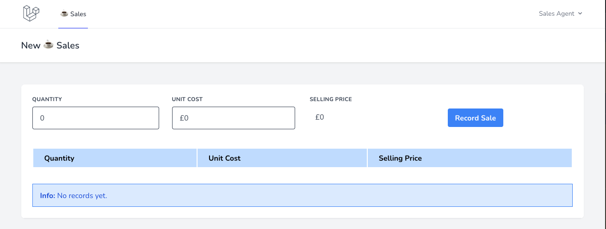
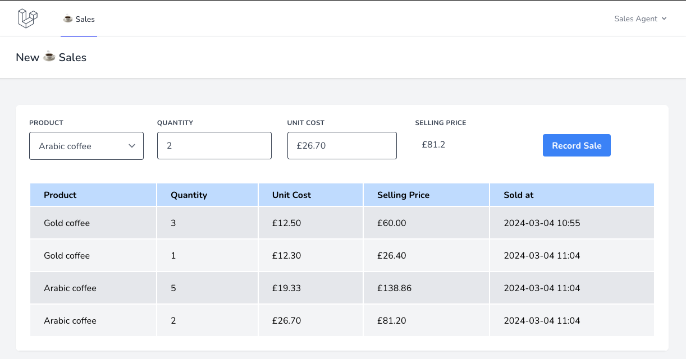

# Notes

## Part 1

- Local dev setup remains the same
- I decided to integrate Vue.js into the project, implementing the sales form with a custom component.
- I went with Vue because the brief specified the need to quickly add records for customers, and a Vue component would remove the need for traditional form submission and page reload, providing instant table refresh the user. 
- I also added versioning to mix to add cache busting params to the compiled js and css files. 
- As we are only concerned with one product, I just created a simple sales table and Sale model to manage sales records.
- I created a `SalesController` to handle sales view and other POST routes used by the Vue component.
- Request handlers for each post route can be found in `Http/Requests`
- I added unit testing for the SalesController in `tests/Feature/Controller/` and also for the Sale Model in `tests/Unit/Models/`.
- Instead of the `Money package` provided I used [vue-currency-input](https://dm4t2.github.io/vue-currency-input/) to help with handling money inputs.
- I'm enjoying the task, I could spend ages chipping away and improving on Part 1, but I'm conscious that there's a part 2 to get done... 

### Usage

- Login and navigate to `/sales`. Before you have saved and records you will see the below info message:

- In order to populate the table simply enter a valid `Quantity` and `Unit Cost`. You will see the `Selling Price` calculated in real time. Press `Record Sale`.
- The table will look as follows once you have recorded a few sales:

## Part 2

- For this part I added a new products table to store the coffee products. I then added the `product_id` foreign key column to the `sales` table.
- To prepare local dev run `php artisan migrate:fresh --seed`. In real environments where we care about the data I would just run the migration and perhaps use Laravel Tinker to add the original coffee to the `product_id` column for all existing sales. Ideally I'd also create another admin page for adding new coffee products so that the user can manage it themselves.
- The product dropdown is populated from the products table and the sale history table by joining the products and sales tables.
- I added new Product tests and modified existing tests to incorporate the new `product_id` field. I also modified the `SaleRecordRequest` handler to check if products exits before storing in sales.
- I added a global Vue filter for formatting dates using `moment.js`.
- I'm committing the css and js compiled for dev like it is in the base repo, but in real life this would be handled by a build script or pipeline based on the environment.
- This is the kind of project that you could really keep adding to and improving given the time. 
- For example here are some things I didn't get a chance to implement, but would like:
  - Some throttling/delay on calculating the selling price.
  - A loading bar on submit to give some visual feedback to the user.
  - Order by column functionality on the sales history table. 
  - Chunking the sales query results and implementing pagination or infinite scrolling.
  - More tests around calculation and rounding. 
  - More informative error handling.
  - And I'm sure I'll think of loads more after I submit this :) 

### Usage

- Below you can see the Product dropdown added to the form and the additional fields added to the table. 
- It is used in the same way outlined above in Part 1.

