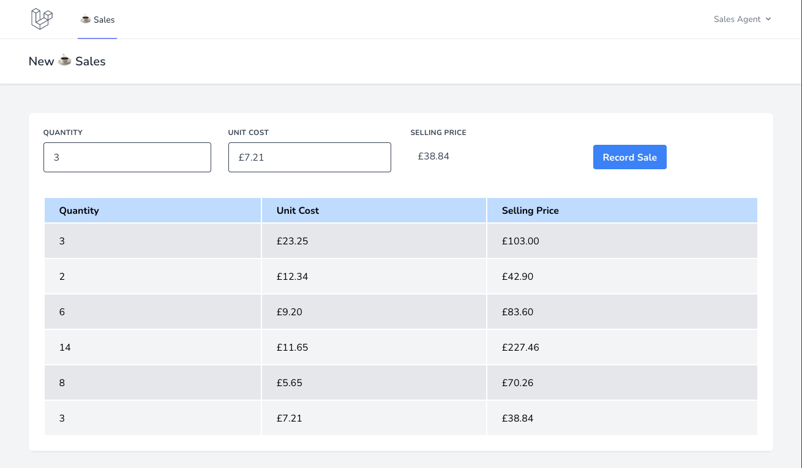

# Notes

## Part 1

- Local dev setup remains the same
- I decided to integrate Vue.js into the project, implementing the sales form with a custom component.
- I went with Vue because the brief specified the need to quickly add records for customers, and a Vue component would remove the need for traditional form submission and page reload, providing instant table refresh the user. 
- I also added versioning to mix to add cache busting params to the compiled js and css files. 
- As we are only concerned with one product, I just created a simple sales table and Sale model to manage sales records.
- I created a `SalesController` to handle sales view and other POST routes used by the Vue component.
- Request handlers for each post route can be found in `Http/Requests`
- I added unit testing for the SalesController in `tests/Feature/Controller/` and also for the Sale Model in `tests/Unit/Models/`.
- Instead of the `Money package` provided I used [vue-currency-input](https://dm4t2.github.io/vue-currency-input/) to help with handling money inputs.
- I'm enjoying the task, I could spend ages chipping away and improving on Part 1, but I'm conscious that there's a part 2 to get done... 

### Usage

- Login and navigate to `/sales`. Before you have saved and records you will see the below info message:

- In order to populate the table simply enter a valid `Quantity` and `Unit Cost`. You will see the `Selling Price` calculated in real time. Press `Record Sale`.
- The table will look as follows once you have recorded a few sales:

